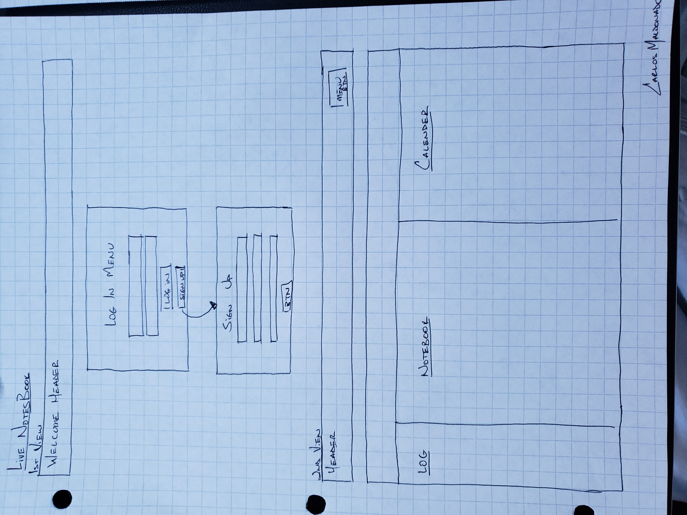
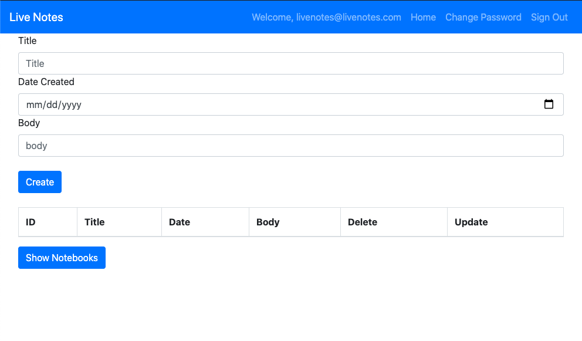

# Live Notes

This app is a personal notebook with where you can create or delete new notebooks for different subjects.

## Important Links
- [Client Repo] https://github.com/malcar91/LiveNotes-Client
- [Client Deployed] https://malcar91.github.io/LiveNotes-Client/
- [API Repo] https://github.com/malcar91/LiveNotes-Server
- [API Deployed] https://whispering-ravine-93747.herokuapp.com/

## Planning Story

I started with designing the wireframes to give me a good layout of how I want the site to look like. Then drawing out my ERD to get a visual idea of my one to many relationships. Then set up my client and server side to make sure it is all up and running. Then check all the auths, sign in, log out etc for basic functionality. Then moving onto creating, deleting and updating a notes, in the notebooks.

## User Story

1. When reaching the site user will be prompt to sign in.
2. If user does not have an account then there will be an option to sign in.
3. Once signed in, you will have a notebook layout and user can start with creating a new notebook.
4. User then can add notes, delete or update notes.
5. User once done be able to save their notes.
6. User then can log out.

## Technologies Used

- REACT
- EXPRESS

## Wireframe

## App Screenshpt

## Unsolved Problems

- the update notebook feature is no longer working, I was able to redirect the update button in the table to a different page and succesfully update the notebook and now it is not working.
